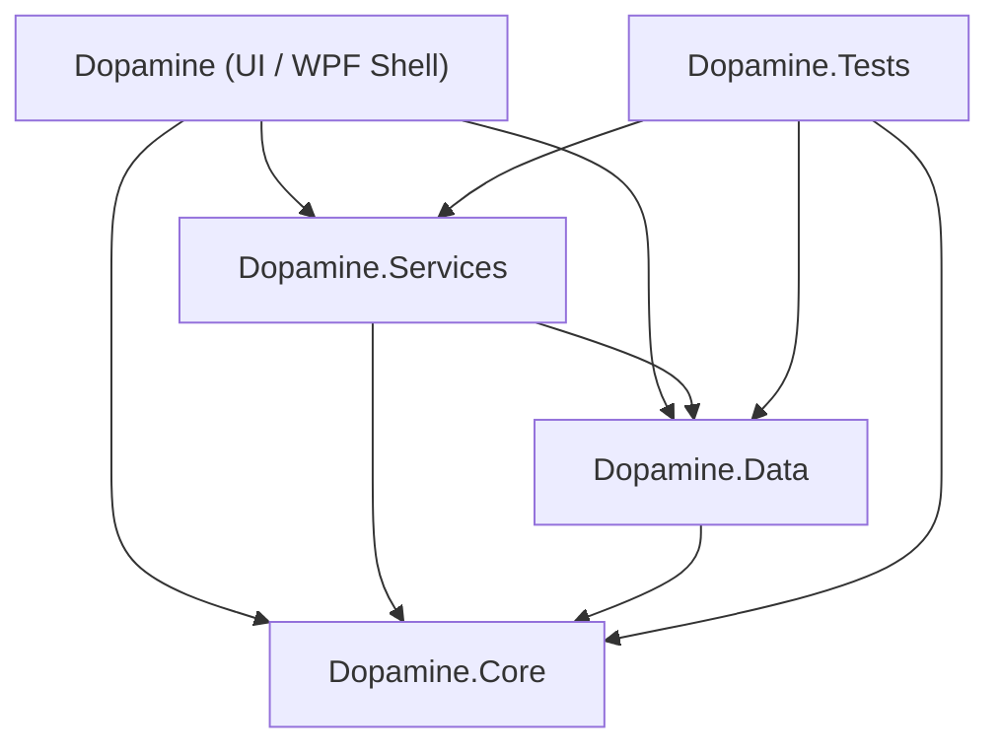
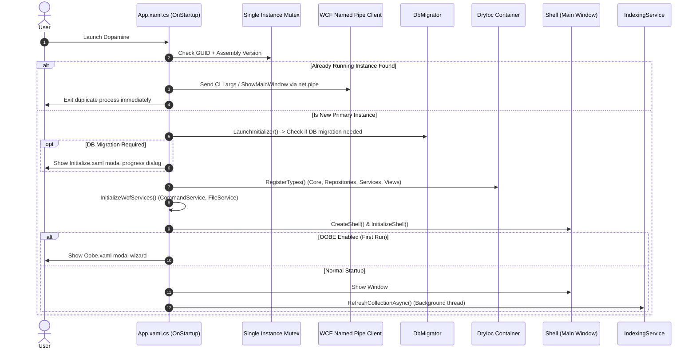

# 01. Architecture, Startup & Lifecycle

## 1. High-Level Technology Stack

- **Target Framework**: .NET Framework 4.6.1+ / C#
- **UI Framework**: Windows Presentation Foundation (WPF) with XAML
- **MVVM / Modular Architecture**: Prism (v7.x) using `DryIoc` container (`Prism.DryIoc.PrismApplication`)
- **Audio Engine**: CSCore (Core Audio Library for .NET) with WASAPI / DirectSound / MediaFoundation / FFmpeg native interop
- **Database / ORM**: SQLite (`sqlite-net`) with custom migration framework (`DbMigrator`)
- **Metadata Extraction**: TagLib-sharp with custom ID3 multi-value tag patchers
- **IPC (Inter-Process Communication)**: WCF Named Pipes (`StrongNetNamedPipeBinding`)
- **External Frameworks & Utilities**: Digimezzo.Foundation (Settings, Logging, IO, Windowing utils), DiscordRPC, Last.fm API

---

## 2. Solution Structure & Project Dependency Graph

### Projects Breakdown

| Project | Responsibility | Key Namespaces / Folders |
| :--- | :--- | :--- |
| **`Dopamine`** | Main entry executable, XAML Windows/Views, ViewModels, Custom Controls, Converters, Language resources, App Bootstrapper. | `Dopamine`, `Dopamine.Views`, `Dopamine.ViewModels`, `Dopamine.Controls` |
| **`Dopamine.Services`** | Business logic layer: Audio playback, Library indexing, Folder watching, Playlists, Theming, Metadata, Scrobbling, Lyrics, Discord RPC, WCF servers. | `Dopamine.Services.Playback`, `Dopamine.Services.Indexing`, `Dopamine.Services.Appearance`, etc. |
| **`Dopamine.Data`** | Data layer: SQLite Connection factory, Schema migrations (v1-v27), Entity POCOs, Repositories, Metadata extraction models. | `Dopamine.Data.Repositories`, `Dopamine.Data.Entities`, `Dopamine.Data.Metadata` |
| **`Dopamine.Core`** | Foundation & Domain primitives: Low-level audio player wrapper (`CSCorePlayer`), Web API clients (Last.fm, Lyrics, GitHub), Constants, Enums, Extension methods. | `Dopamine.Core.Audio`, `Dopamine.Core.Api`, `Dopamine.Core.Base` |
| **`Dopamine.Tests`** | Unit and integration test suites. | Test fixtures for indexing, playlist parsing, metadata, algorithms |
| **`Dopamine.Packager`** | Build release tools, installer configuration, and portable packaging scripts. | Release bundling utilities |

---

## 3. Application Startup Sequence

The entry point is located in `Dopamine/App.xaml.cs` inheriting from `PrismApplication`.

### Key Startup Operations

1. **Single Instance Enforcement (`Mutex`)**:
   - Mutex Name: `${ProductInformation.ApplicationGuid}-${ProcessExecutable.AssemblyVersion()}`
   - If mutex acquisition fails, `ProcessCommandLineArguments` forwards CLI arguments to the running instance via `net.pipe://localhost/Dopamine/FileService` or issues a `ShowMainWindowCommand()` via `net.pipe://localhost/Dopamine/CommandService`, then cleanly exits.

2. **Database Migration Pre-Check (`LaunchInitializer`)**:
   - `Initializer.IsMigrationNeeded()` checks if database file exists and its version matches schema requirements.
   - If migration is needed, `Initialize.xaml` is displayed modally with explicit shutdown mode protection (`ShutdownMode.OnExplicitShutdown`).

3. **Prism Container Registration (`RegisterTypes`)**:
   - Registers core singletons: `ISQLiteConnectionFactory`, Repositories (`TrackRepository`, `FolderRepository`, `AlbumArtworkRepository`, `QueuedTrackRepository`, `BlacklistTrackRepository`), and Services (`PlaybackService`, `IndexingService`, `AppearanceService`, `LyricsService`, `DiscordRichPresenceService`, etc.).
   - Registers navigation Views with DryIoc for Region-based navigation.

4. **WCF Named Pipe Server Initialization (`InitializeWcfServices`)**:
   - Hosts `ICommandService` at `net.pipe://localhost/Dopamine/CommandService`
   - Hosts `IFileService` at `net.pipe://localhost/Dopamine/FileService`

5. **Shell Creation & Region Adapter Setup**:
   - Resolves `Shell` (the master window).
   - Maps `SlidingContentControlRegionAdapter` for smooth animated page transitions between subviews.

---

## 4. Lifecycle & Graceful Shutdown

1. **Explicit vs MainWindow Close**:
   - During OOBE or DB migrations, `Application.Current.ShutdownMode` is set to `ShutdownMode.OnExplicitShutdown` to prevent dialog close from killing the app.
   - Once initialized, it reverts to `ShutdownMode.OnMainWindowClose` (or tray minimization if configured).

2. **Teardown & Resource Disposal**:
   - `LifetimeService` and `ShellViewModel` handle `Closing` events.
   - Saves current playback queue to SQLite (`QueuedTrack` table).
   - Flushes playback counters (play counts, skip counts, last played timestamps).
   - Disposes audio output stream (`CSCorePlayer.CloseSoundOut()`).
   - Closes WCF Service Hosts and named pipe endpoints.
   - Stops filesystem watcher threads (`FolderWatcherManager`).
