# 02. Audio Engine & Digital Signal Processing (DSP)

## 1. Audio Engine Architecture

Dopamine uses the **CSCore** (Core Audio Library for .NET) ecosystem wrapped inside `CSCorePlayer.cs` (`Dopamine.Core.Audio`) and managed by `PlaybackService.cs` (`Dopamine.Services.Playback`).

```mermaid
graph LR
    File["Audio File / Stream (File.OpenRead)"] --> Decoder{"Decoder Selection"}
    Decoder -->|"WMA & MediaFoundation"| MFDecoder["MediaFoundationDecoder"]
    Decoder -->|"All Other Formats"| FFmpegDecoder["FfmpegDecoder (Native LGPL)"]
    
    MFDecoder --> Resampler{"SampleRate < 32000 Hz?"}
    FFmpegDecoder --> Resampler
    
    Resampler -->|"Yes"| ResampleNode["ChangeSampleRate(32000)"]
    Resampler -->|"No"| SampleSource["ToSampleSource()"]
    ResampleNode --> SampleSource

    SampleSource --> EqualizerNode["10-Band BiQuad Equalizer"]
    EqualizerNode --> NotificationNode["SingleBlockNotificationStream (FFT Tap)"]
    NotificationNode --> Output{"Output Driver"}

    Output -->|"Windows 10 / Modern (WASAPI)"| WasapiOut["WasapiOut (Shared/Exclusive)"]
    Output -->|"Legacy Fallback"| DirectSoundOut["DirectSoundOut"]

    NotificationNode -.->|"SingleBlockRead Event"| SpectrumAnalyzer["Spectrum Analyzer / Rainmeter FFT"]
```

---

## 2. Decoders & Codec Pipeline

Located in `CSCorePlayer.GetCodec(string filename)`:

1. **Decoder Resolution**:
   - **WMA & WMA Lossless**: When Windows Media Foundation is available, Dopamine routes `.wma` files through `MediaFoundationDecoder` because native FFmpeg builds may lack full WMA Lossless support.
   - **General Formats**: Formats like MP3, FLAC, AAC/M4A, OGG, WAV, APE, OPUS, and MPC are decoded via `FfmpegDecoder`.
   - **Unicode/Path Handling Hack**: To bypass FFmpeg C-runtime issues with non-ASCII characters in file paths (e.g. `æ`, `ø`), Dopamine opens a managed `FileStream` first (`File.OpenRead(filename)`) and passes the stream to `FfmpegDecoder(Stream)` instead of passing a raw file path string.

2. **Sample Rate Pre-Conditioning**:
   - The 10-band equalizer has a top band filter at **16,000 Hz**.
   - By Nyquist theorem, the sample rate must strictly exceed $2 \times 16,000\text{ Hz} = 32,000\text{ Hz}$.
   - If `waveSource.WaveFormat.SampleRate < 32000`, Dopamine immediately converts it via `waveSource.ChangeSampleRate(32000)`.

---

## 3. 10-Band Equalizer & Filter Design

Located in `CSCorePlayer.Create10BandEqualizer(ISampleSource source)` and `EqualizerService.cs`:

- **Filter Topology**: CSCore BiQuad peak filters arranged in series across all audio channels.
- **Default Bandwidth**: `18` (in semitones / Q factor scaling).
- **Gain Range**: $-20\text{ dB}$ to $+20\text{ dB}$.

### Frequency Bands Matrix

| Band # | Center Frequency | Audio Spectrum Region |
| :---: | :---: | :--- |
| **Band 1** | `31 Hz` | Sub-bass |
| **Band 2** | `62 Hz` | Bass |
| **Band 3** | `125 Hz` | Upper Bass |
| **Band 4** | `250 Hz` | Low Midrange |
| **Band 5** | `500 Hz` | Midrange |
| **Band 6** | `1,000 Hz` | Center Midrange |
| **Band 7** | `2,000 Hz` | Upper Midrange |
| **Band 8** | `4,000 Hz` | Presence / Treble |
| **Band 9** | `8,000 Hz` | Brilliance |
| **Band 10** | `16,000 Hz` | Air / Ultra-highs |

### Presets & Persistence
Presets are stored as XML files (`EqualizerPresets.xml`) with band gains mapped as an array of 10 doubles `double[10]`. Custom user presets are stored dynamically and applied in real time via `CSCorePlayer.ApplyFilter(double[] filterValues)`.

---

## 4. Real-Time Spectrum Analysis & FFT Notification Stream

Dopamine supports high-speed, low-latency spectrum visualization both within its UI and externally:

1. **`SingleBlockNotificationStream` Interceptor**:
   - Placed directly between the EQ sample source and the output driver.
   - For every audio sample block processed during audio playback, the stream fires the `SingleBlockRead` event.

2. **Fast Fourier Transform (FFT)**:
   - `SpectrumAnalyzer.cs` (WPF control) consumes blocks into an `FftProvider(channels, FftSize.Fft4096)`.
   - Generates frequency power bins plotted onto WPF drawing contexts using bar, line, or peak representations.

3. **External Spectrum Export (WCF IPC)**:
   - When external control is enabled, `FftDataServer` pipes FFT frequency buckets across local named pipes (`net.pipe://localhost/Dopamine/ExternalControlService/FftDataServer`) enabling Rainmeter skins and desktop widgets to visualize Dopamine audio at 60 FPS.

---

## 5. Sound Out Drivers & Device Routing

1. **WASAPI Output (`WasapiOut`)**:
   - Default driver on Windows 10 / modern Windows.
   - Latency: `100 ms` default.
   - Thread Priority: `ThreadPriority.Highest`.
   - **Channel Matrix Mixing**: `UseChannelMixingMatrices = useAllAvailableChannels` (allows upmixing mono/stereo tracks across 5.1/7.1 speaker setups).
   - **Stream Routing Options**:
     - On Default Device: `StreamRoutingOptions.All` (automatically routes audio without restart if Windows switches from speakers to headphones).
     - On Specific Device: `StreamRoutingOptions.OnDeviceDisconnect`.

2. **DirectSound Output (`DirectSoundOut`)**:
   - Fallback mode for legacy systems or environments lacking WASAPI initialization.
