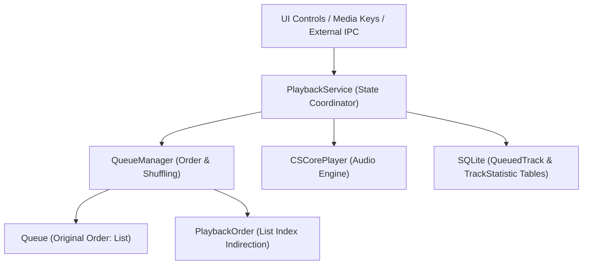

# 03. Playback & Queue Management

## 1. Overview of Playback Architecture

The playback subsystem in Dopamine is split into two primary components:
1. **`PlaybackService.cs`**: Manages audio playback lifecycle, timers, volume, looping, hardware/system events, statistics accumulation, and state synchronization.
2. **`QueueManager.cs`**: Handles queue collections, ordering, index indirection for shuffling, and track history.



---

## 2. Queue Manager & Shuffling Engine

Instead of mutating the actual track list during a shuffle, Dopamine uses **Index Indirection**:

```
Queue List:          [ Track A,  Track B,  Track C,  Track D ] (Indices: 0, 1, 2, 3)
Sequential Order:    [ 0,        1,        2,        3 ]
Shuffled Order:      [ 2,        0,        3,        1 ] -> Plays C -> A -> D -> B
```

### Key Queue Behaviors in `QueueManager.cs`

1. **Shuffle while playing**:
   - When a user clicks Shuffle while a track (e.g., Track B, index 1) is currently playing, Dopamine places the active track's index at the front (`index 0`) of `playbackOrder` and randomizes the remaining indices using Fisher-Yates extension (`ListExtensions.Randomize()`).
   - This ensures **playback is never abruptly interrupted** or restarted upon toggling shuffle.

2. **Un-Shuffle**:
   - Restores `playbackOrder` back to `Enumerable.Range(0, queue.Count).ToList()` without changing the currently playing song index.

3. **Loop Modes (`LoopMode`)**:
   - `LoopMode.None`: Plays through `playbackOrder` until the last track; stops playback upon queue completion.
   - `LoopMode.All`: When the end of `playbackOrder` is reached, loops back to the start index.
   - `LoopMode.One`: Continuously repeats the current track without advancing the queue index.

---

## 3. Playback State Machine & Events

`PlaybackService` publishes granular events consumed by the UI, Windows integrations, scrobblers, and discord presence:

| Event | Fired When |
| :--- | :--- |
| `PlayingTrackChanged` | The active track switches to a new song. |
| `PlaybackSuccess` | Track successfully loaded and began playing. |
| `PlaybackPaused` | Playback was paused by user or OS event. |
| `PlaybackResumed` | Playback resumed from paused state. |
| `PlaybackStopped` | Playback stopped completely (sound out disposed). |
| `PlaybackFinished` | CSCore reached the end of the current audio file. |
| `PlaybackFailed` | Codec or IO failure opening the audio stream. |
| `ProgressChanged` | Fired every `0.5s` by `progressTimer` to update seek sliders. |

---

## 4. Track Statistics & Counters (Play / Skip / Last Played)

Dopamine tracks listening habits and updates metadata in SQLite:

1. **Play Count Increment**:
   - A track is marked as "Played" when playback crosses either **50% of the duration** or **30 seconds** (whichever comes first).
   - `PlayCount` is incremented, and `DateLastPlayed` is stamped with the Unix timestamp.

2. **Skip Count Increment**:
   - If the user skips to the next track before the "Played" threshold is reached (and after playing for at least 5 seconds), `SkipCount` is incremented.

3. **Debounced DB Writes (`savePlaybackCountersTimer`)**:
   - Rather than executing synchronous disk I/O on every skip/tick, counters are staged in a thread-safe `Dictionary<string, PlaybackCounter>` in memory.
   - A 2-second timer periodically batches updates into `Track` and `TrackStatistic` SQLite tables via `trackRepository.UpdatePlaybackCountersAsync()`.

---

## 5. Queue Persistence (Crash Recovery & App Resumption)

To allow resuming music exactly where the user left off:
1. Every time the queue changes or playback position advances significantly, `saveQueuedTracksTimer` triggers after a 5-second debounce.
2. The entire queue is written to the `QueuedTrack` SQLite table:
   - `Path` / `SafePath`
   - `OrderID` (index order in playback)
   - `IsPlaying` (marks which track was active)
   - `ProgressSeconds` (timestamp in seconds)
3. On application launch, `PlaybackService.GetSavedQueuedTracksAsync()` restores the entire queue into memory with seek position restored.
