# 04. Database & Data Layer Architecture

## 1. Overview & Connection Architecture

Dopamine utilizes an embedded **SQLite** database (`Dopamine.db`) located in the user application data directory (or application root if running in Portable mode).

Data access is orchestrated through:
- **`SQLiteConnectionFactory.cs`**: Implements `ISQLiteConnectionFactory` providing transient connections (`SQLiteConnection`) with thread-safe pooling.
- **`DbMigrator.cs`**: Handles declarative database versioning and sequential schema upgrades from v1 to v27.
- **Repository Pattern**: Explicit CRUD and query services for domain models.

---

## 2. Database Schema & Entity Relationships

```mermaid
erDiagram
    FOLDER ||--o{ FOLDER_TRACK : contains
    TRACK ||--o{ FOLDER_TRACK : indexed_in
    TRACK ||--o{ ALBUM_ARTWORK : "keyed by AlbumKey"
    TRACK ||--o{ TRACK_STATISTIC : "mirrors SafePath"
    TRACK ||--o{ BLACKLIST_TRACK : "filtered by SafePath"
    TRACK ||--o{ QUEUED_TRACK : "persisted queue"

    FOLDER {
        int FolderID PK
        string Path
        string SafePath
        int ShowInCollection
    }

    TRACK {
        int TrackID PK
        string Artists
        string Genres
        string AlbumTitle
        string AlbumArtists
        string AlbumKey
        string Path
        string SafePath
        string FileName
        string MimeType
        int FileSize
        int BitRate
        int SampleRate
        string TrackTitle
        int TrackNumber
        int TrackCount
        int DiscNumber
        int DiscCount
        int Duration
        int Year
        int HasLyrics
        int DateAdded
        int DateFileCreated
        int DateFileModified
        int DateLastSynced
        int NeedsIndexing
        int NeedsAlbumArtworkIndexing
        int IndexingSuccess
        string IndexingFailureReason
        int Rating
        int Love
        int PlayCount
        int SkipCount
        int DateLastPlayed
    }

    ALBUM_ARTWORK {
        int AlbumArtworkID PK
        string AlbumKey
        string ArtworkID
    }

    FOLDER_TRACK {
        int FolderTrackID PK
        int FolderID FK
        int TrackID FK
    }

    QUEUED_TRACK {
        int QueuedTrackID PK
        string Path
        string SafePath
        int IsPlaying
        int ProgressSeconds
        int OrderID
    }

    TRACK_STATISTIC {
        int TrackStatisticID PK
        string Path
        string SafePath
        int Rating
        int Love
        int PlayCount
        int SkipCount
        int DateLastPlayed
    }

    BLACKLIST_TRACK {
        int BlacklistTrackID PK
        string Artist
        string Title
        string Path
        string SafePath
    }
```

---

## 3. The `SafePath` Pattern

A critical design pattern used across all Dopamine tables is **`SafePath`**:
- Windows path comparisons are case-insensitive, but SQLite default `TEXT` comparisons are case-sensitive and can behave inconsistently with accented/Unicode filenames.
- `SafePath` stores a normalized, trimmed, and lowercased invariant representation of the path (`path.Trim().ToLowerInvariant()`).
- High-performance SQLite indices (`TrackSafePathIndex`, `TrackStatisticSafePathIndex`, `BlacklistTrackSafePathIndex`) are built directly on `SafePath`.

---

## 4. Database Migration Engine (`DbMigrator.cs`)

Dopamine uses a reflection-driven, sequential migration mechanism:
- Current Target Version: **`CURRENT_VERSION = 27`**
- Version tracking: Stored in the `Configuration` table (`Key = 'DatabaseVersion'`).

### Migration Flow

1. On startup, `DbMigrator.IsMigrationNeeded()` reads the user's current DB version.
2. If `userDatabaseVersion < CURRENT_VERSION`, it scans `DbMigrator` methods annotated with `[DatabaseVersion(N)]`.
3. Upgrades are executed sequentially in order (e.g., $v22 \to v23 \to v24 \to v25 \to v26 \to v27$).
4. Each migration method alters tables, builds new indices, cleans orphaned tracks, or recalculates album artwork keys.
5. Once all migrations succeed, the `Configuration` table is updated with `DatabaseVersion = 27`.

---

## 5. Repositories Breakdown

| Repository | Interface | Key Responsibilities |
| :--- | :--- | :--- |
| **`TrackRepository`** | `ITrackRepository` | Track querying by artist/album/genre/folder, metadata updating, ratings, love toggle, batch playback statistics, orphaned track cleanup. |
| **`FolderRepository`** | `IFolderRepository` | Monitored music folder CRUD, path validation, inclusion/exclusion in library view. |
| **`AlbumArtworkRepository`** | `IAlbumArtworkRepository` | Maps calculated `AlbumKey` strings to unique `ArtworkID` hash identifiers. |
| **`QueuedTrackRepository`** | `IQueuedTrackRepository` | Serializes and restores the playback queue across sessions. |
| **`BlacklistTrackRepository`** | `IBlacklistTrackRepository` | Tracks explicitly excluded from the library by user preference. |
