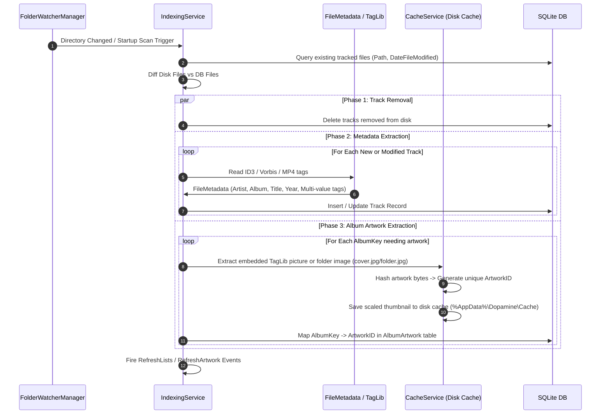

# 05. Indexing, Metadata & Artwork Caching

## 1. Library Indexing Architecture

The indexing pipeline monitors user-configured music directories, extracts tag metadata and embedded artwork, computes album groupings, and synchronizes the SQLite database.

---

## 2. Filesystem Monitoring (`FolderWatcherManager`)

Dopamine avoids hammering the disk with `GentleFolderWatcher`:
- Uses .NET `FileSystemWatcher` wrapped with event throttling/debouncing.
- Filters events (`Created`, `Changed`, `Deleted`, `Renamed`).
- Ignores temporary files, playlist files, and non-supported extensions.
- When disk changes settle, raises `FoldersChanged` to trigger incremental indexing.

---

## 3. Metadata Extraction & ID3 Tag Cleaning

Located in `Dopamine.Data.MetaDataUtils.cs`:

### 1. Multi-Value Tag Delimiting
- Artists and Genres often contain multiple values (e.g. `["Queen", "David Bowie"]`).
- In ID3v2.3, slash `/` was historically used as a separator, which corrupted artists like `AC/DC`.
- `MetadataUtils.PatchID3v23Enumeration()` joins known unsplittable tokens (`Defaults.UnsplittableTagValues`) before splitting and reformats them using Dopamine's internal multi-value delimiter format: `; ` or bracket-delimited tokens.

### 2. Album Key Generation (`AlbumKey`)
To correctly group tracks into cohesive albums (preventing split albums across multi-disc or varied artist tracks):
- Algorithm: `GenerateInitialAlbumKey(AlbumTitle, AlbumArtists)`
- Evaluates:
  1. Album Title (normalized, whitespace-trimmed).
  2. Album Artist (`AlbumArtists` tag). If empty, falls back to `Artist` or flags as `Various Artists` for compilations.
  3. Year (if configured to split same-titled albums).

---

## 4. Artwork Extraction, Caching & Hashing

Located in `CacheService.cs` (`Dopamine.Services.Cache`):

### Artwork Resolution Hierarchy
When indexing artwork for a track/album:
1. **Embedded TagLib Artwork**: Scans embedded front covers in audio file tags (`IPicture`).
2. **Folder Cover Images**: If no embedded art exists, scans the audio file's directory for known artwork names:
   - `cover.jpg`, `cover.png`
   - `folder.jpg`, `folder.png`
   - `albumart.jpg`, `front.jpg`
3. **Online Download Fallback**: If configured, `InfoDownloadService` queries Last.fm / Fanart.tv APIs for missing album art.

### Artwork Deduplication & Caching
- Raw image bytes are hashed (MD5 / SHA) to create an **`ArtworkID`**.
- Duplicate album artworks across different albums share the exact same cached image file on disk.
- Cache location: `%AppData%\Dopamine\Cache\Artwork\{ArtworkID}.jpg`.
- Images are pre-scaled and optimized for fast WPF asynchronous bitmap loading (`BitmapImage` with `DecodePixelWidth` to minimize RAM).
