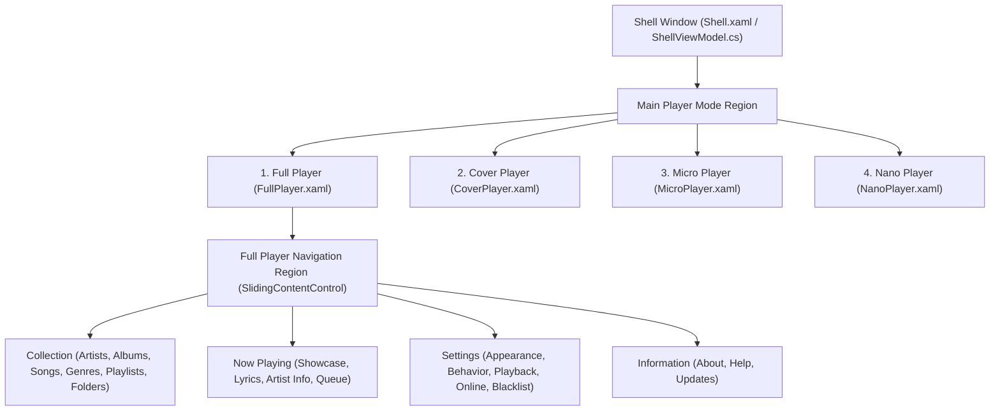

# 06. UI Architecture, MVVM & Player Modes

## 1. WPF & Prism MVVM Architecture

Dopamine's user interface is built on **WPF** using **Prism MVVM** and a Region-based view composition model.

---

## 2. The 4 Distinct Player Modes

Dopamine supports switching on the fly between 4 distinct window layouts:

| Mode | View | Target Use Case & Characteristics |
| :--- | :--- | :--- |
| **Full Player** | `FullPlayer.xaml` | Full-featured library browser, playlist editor, lyrics viewer, settings manager, and equalizer. |
| **Cover Player** | `CoverPlayer.xaml` | Medium-sized square widget dominated by high-resolution album artwork with floating hover transport controls. |
| **Micro Player** | `MicroPlayer.xaml` | Horizontal thin desktop bar showing track info, progress bar, volume, and playback buttons. |
| **Nano Player** | `NanoPlayer.xaml` | Ultra-compact minimalist floating control bar taking up minimal screen real estate. |

### Smooth Page Navigation (`SlidingContentControlRegionAdapter`)
Sub-page navigation inside the Full Player uses a custom Prism region adapter (`SlidingContentControlRegionAdapter.cs`) that animates sliding transitions (left-to-right / right-to-left) between views when switching tabs.

---

## 3. Now Playing Views

Located in `Dopamine.Views.NowPlaying`:

1. **`NowPlayingShowcase.xaml`**:
   - High-impact visualizer view.
   - Dynamic blurred background derived from active album cover.
   - Large album artwork, high-resolution metadata typography, and live embedded `SpectrumAnalyzer` audio visualizer.

2. **`NowPlayingLyrics.xaml`**:
   - Displays real-time synchronized `.lrc` lyrics with auto-scrolling highlight or static song text.
   - Manual lyrics lookup and override editing tools.

3. **`NowPlayingArtistInformation.xaml`**:
   - Integrates with Last.fm API to render artist biographies, member details, and high-res photography.

4. **`NowPlayingPlaylist.xaml`**:
   - Live view of current playback queue.
   - Supports drag-and-drop track reordering, removing, shuffling, and jump-to-track.

---

## 4. Theming, Accent Colors & Dynamic Palette Extraction

Located in `Dopamine.Services.Appearance.AppearanceService`:

### 1. Theme Mode
- Dark Theme (Default) vs Light Theme.
- Handled by swapping WPF Resource Dictionaries at runtime (`Theme.Dark.xaml` / `Theme.Light.xaml`).

### 2. Accent Color Resolution
Dopamine supports 3 distinct modes for the UI accent color:
1. **Preset / Custom Color Schemes**:
   - Built-in colors (Blue, Green, Yellow, Purple, Pink).
   - User-defined XML color profiles loaded from `%AppData%\Dopamine\ColorSchemes\{Name}.xml`.
2. **Follow Windows System Color**:
   - Hooks Win32 message `WM_DWMCOLORIZATIONCOLORCHANGED` (0x0320) via HwndSource hook.
   - Queries Windows Registry / DWM API for Windows Accent Color and updates WPF theme brushes in real time.
3. **Follow Album Cover Color**:
   - On `PlaybackSuccess`, extracts the dominant vibrant color from the current track's album artwork using color quantization algorithms.
   - Dynamically re-tints playback sliders, buttons, highlight bars, and active tabs to match the playing album.

---

## 5. Custom WPF Controls Suite

Located in `Dopamine.Controls`:

- **`SpectrumAnalyzer.cs`**: High-performance canvas control calculating FFT bins into bars or line curves.
- **`AccentTextBox.cs` / `SearchBox.cs`**: Custom search and filter inputs with clear buttons and themed focus glows.
- **`LoveButton.cs` / `RatingButton.cs`**: Animated interactive heart (love) and 5-star rating controls.
- **`SyncRing.cs`**: Rotating modern indeterminate progress ring for indexing feedback.
- **`TransitioningContentControl.cs` / `CrossFadeContentControl.cs`**: Fade and slide transitions for image and view updates.
