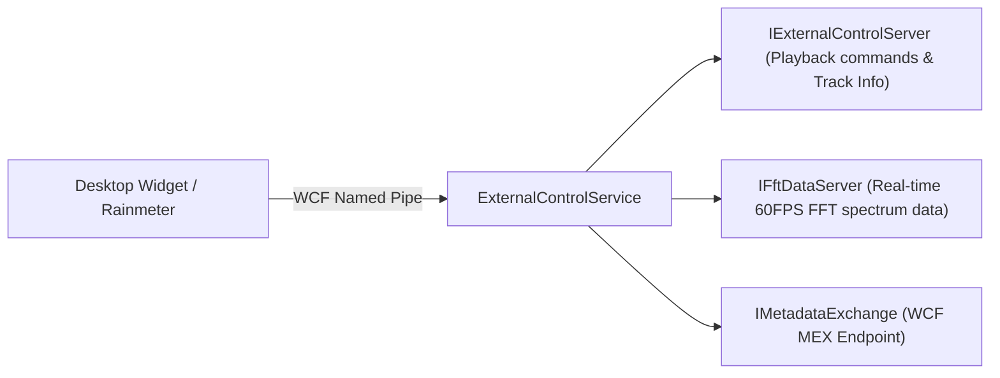
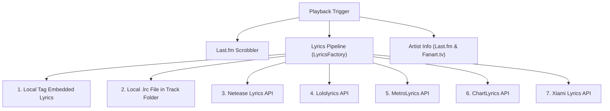

# 07. External Integrations, Windows OS & Online Services

## 1. Inter-Process Communication & External Control API

Dopamine exposes a WCF Named Pipe API (`ExternalControlService.cs`) that allows third-party tools (such as Rainmeter, Stream Decks, and desktop widgets) to monitor and control the player.



- **Playback Endpoint**: `net.pipe://localhost/Dopamine/ExternalControlService`
  - Methods: `Play()`, `Pause()`, `Next()`, `Previous()`, `GetTrackInfo()`, `SetVolume()`.
- **FFT Spectrum Endpoint**: `net.pipe://localhost/Dopamine/ExternalControlService/FftDataServer`
  - Streams raw frequency bins for visualizers without needing WASAPI loopback drivers.

---

## 2. Windows 10 & Desktop Integrations

### 1. System Media Transport Controls (SMTC)
Located in `WindowsIntegrationService.cs` & `NotificationService.cs`:
- Integrates with Windows 10 native media overlay (volume OSD and hardware media key bar).
- Synchronizes track title, artist, album art thumbnail, and timeline state.
- Handles hardware play/pause/prev/next media keys.

### 2. Notifications (Dual Engine)
- **Windows 10 Action Center Toast Notifications (`NotificationService`)**:
  - Uses Windows 10 WinRT `ToastNotificationManager` with rich XML templates containing album artwork and playback action buttons.
- **Legacy Notification Fallback (`LegacyNotificationService`)**:
  - For Windows 7, Windows 8, and Windows 10 Enterprise N/LTSB editions lacking MediaFoundation/WinRT dependencies, displays a smooth custom WPF popup window at the bottom-right corner of the desktop.

### 3. Taskbar & JumpList Integration
- **Thumbnail Toolbar Buttons (`TaskbarService.cs`)**:
  - Adds Play/Pause, Next, Previous, and Love buttons directly into the Windows taskbar preview window (`ThumbButtonInfo`).
- **JumpList (`JumpListService.cs`)**:
  - Adds Quick Actions to the taskbar right-click menu (e.g. "Play/Pause", "Next", "Donate", "Shuffle All").

### 4. Windows Sleep Prevention
- When `PreventSleepWhilePlaying` is enabled, calls Win32 API `SetThreadExecutionState`:
  ```csharp
  SetThreadExecutionState(EXECUTION_STATE.ES_SYSTEM_REQUIRED | EXECUTION_STATE.ES_CONTINUOUS);
  ```
- Prevents Windows from entering sleep or standby mode while music is active, then restores default power behavior upon pause or stop.

---

## 3. Online Metadata, Lyrics & Scrobbling



### 1. Last.fm Scrobbling (`ScrobblingService.cs`)
- Submits "Now Playing" status immediately upon track start.
- Submits scrobble record once the track crosses the **50% duration** or **240-second** milestone (in compliance with Last.fm Scrobbling 2.0 specs).

### 2. Multi-Tiered Lyrics Pipeline (`LyricsService.cs`)
- First checks for embedded lyrics in audio tags.
- Next checks for local sidecar `.lrc` / `.txt` files matching track name in the directory.
- Falls back to querying online lyric providers sequentially via `LyricsFactory`:
  - **Netease**: High-accuracy synchronized `.lrc` lyrics.
  - **Lololyrics**: Synchronized & unsynchronized lyrics.
  - **MetroLyrics**, **ChartLyrics**, **Xiami**: Web search and scrapers.
- `LyricsService` contains an `.lrc` timestamp parser that resolves line timing tags `[mm:ss.xx]` for animated karaoke-style scrolling.

---

## 4. Discord Rich Presence

Located in `Dopamine.Services.Discord.RichPresenceService`:
- Uses `DiscordRPC` library with Dopamine's client ID.
- Displays playing song details in Discord status:
  - Track Title & Artist.
  - Album name.
  - Dynamic elapsed/remaining playback timeline timestamps.
  - Small icon indicating Playing vs Paused state.
