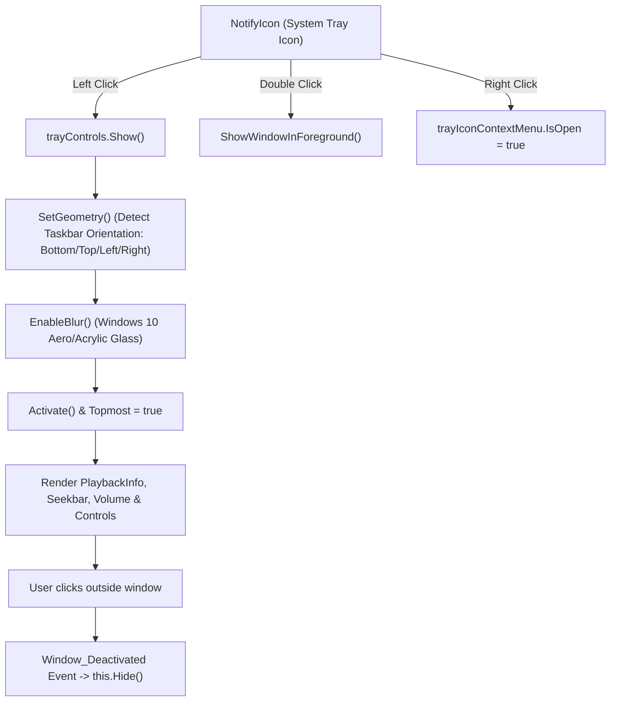

# 08. System Tray Window & Track Transition Decision Engine

## 1. System Tray Controls Window (`TrayControls`)

When Dopamine is minimized or running in the background, interacting with the system tray icon provides immediate preview and playback controls.



---

### Component Hierarchy (`TrayControls.xaml`)

Located at `Dopamine/Views/Common/TrayControls.xaml`:

1. **Window Characteristics**:
   - `WindowStyle="None"`, `ShowInTaskbar="False"`, `Background="Transparent"`.
   - `WindowChrome.GlassFrameThickness = 0.1` for borderless modern rendering.
   - `Topmost = true` to render over other taskbar popups.

2. **UI Controls Embedded in TrayControls**:
   - **`CoverArtControl`** ($60 \times 60\text{ px}$): Renders active album artwork thumbnail.
   - **`PlaybackInfoControl`**: Displays Title, Artist, and Album with marquee/ellipsis formatting.
   - **`HorizontalVolumeControls`**: Inline volume slider ($120\text{ px}$).
   - **`ProgressControlsWithTime`**: Seek slider with current elapsed time and total duration.
   - **`PlaybackControls`**:
     - **Shuffle Button**: Toggles queue shuffling.
     - **Previous Button**: Replays current track or goes to previous track.
     - **Play / Pause Button**: Starts/pauses audio.
     - **Next Button**: Advances track.
     - **Loop Button**: Cycles loop mode (`LoopMode.None` $\to$ `LoopMode.All` $\to$ `LoopMode.One`).
     - **Equalizer Button**: Quick toggle/launch for equalizer.
   - **"Show Dopamine" Button**: Issues `ApplicationCommands.ShowMainWindowCommand` to restore the full application window.

---

### Taskbar Alignment & Auto-Dismiss Algorithm

Located at `Dopamine/Views/Common/TrayControls.xaml.cs`:

```csharp
private void SetGeometry()
{
    var taskbar = new Taskbar();
    Rect desktopWorkingArea = System.Windows.SystemParameters.WorkArea;

    // Detects whether Windows Taskbar is docked at Bottom, Top, Left, or Right
    if (taskbar.Position == TaskbarPosition.Top)
    {
        this.Left = desktopWorkingArea.Right - Constants.TrayControlsWidth - 5;
        this.Top = desktopWorkingArea.Top + 5;
    }
    else if (taskbar.Position == TaskbarPosition.Left)
    {
        this.Left = desktopWorkingArea.Left + 5;
        this.Top = desktopWorkingArea.Bottom - Constants.TrayControlsHeight - 5;
    }
    else // Bottom or Right
    {
        this.Left = desktopWorkingArea.Right - Constants.TrayControlsWidth - 5;
        this.Top = desktopWorkingArea.Bottom - Constants.TrayControlsHeight - 5;
    }
}
```

- **Auto-Dismiss**: The window subscribes to `Window_Deactivated`. When the user clicks anywhere outside the tray window, `Window_Deactivated` immediately calls `this.Hide()`.

---

## 2. Track Transition Decision Engine

How Dopamine decides what to play next, when to restart a track, how loops work, and how blacklisted songs are filtered is defined across `PlaybackService.cs` and `QueueManager.cs`.

```mermaid
graph TD
    Trigger{"Track Transition Trigger"} -->|User Clicked 'Previous'| PrevLogic["PreviousTrackAsync Logic"]
    Trigger -->|User Clicked 'Next'| NextManual["TryPlayNextAsync(userRequested: true)"]
    Trigger -->|Audio Finished (EOF)| NextAuto["TryPlayNextAsync(userRequested: false)"]

    %% Previous Logic
    PrevLogic --> TimeCheck{"Progress > 3.0 Seconds?"}
    TimeCheck -->|"Yes (>3s)"| RestartSong["player.Skip(0) (Restart Current Song)"]
    TimeCheck -->|"No (<=3s)"| LoopOneCheckPrev{"LoopMode == LoopOne?"}
    LoopOneCheckPrev -->|"Yes"| LoopOnePrev["Replay current track"]
    LoopOneCheckPrev -->|"No"| StepPrev["Index = currentTrackIndex - 1"]
    StepPrev --> StartCheck{"At start of queue (Index 0)?"}
    StartCheck -->|"LoopMode.All"| WrapLast["Wrap to playbackOrder.Last()"]
    StartCheck -->|"LoopMode.None"| StopOrFirst["Stop playback"]

    %% Next Manual Logic
    NextManual --> LoopOneCheckNext{"LoopMode == LoopOne?"}
    LoopOneCheckNext -->|"User Clicked Next"| OverrideLoop["Override: Treat as LoopMode.All"]
    LoopOneCheckNext -->|"No"| StepNext["Index = currentTrackIndex + 1"]
    StepNext --> DupCheck{"Same File Path as Current?"}
    DupCheck -->|"Yes (Consecutive duplicates)"| IncrementIndex["Skip to next distinct track"]
    DupCheck -->|"No"| EndQueueCheck{"At End of Queue?"}
    EndQueueCheck -->|"LoopMode.All OR LoopWhenShuffle"| WrapFirst["Wrap to playbackOrder.First()"]
    EndQueueCheck -->|"LoopMode.None"| StopPlayback["Stop()"]

    %% Next Auto Logic
    NextAuto --> IncStats["UpdatePlaybackCountersAsync (PlayCount + 1)"]
    IncStats --> AutoLoop{"Loop Track Decision"}
    AutoLoop --> BlacklistCheck{"Track in Blacklist?"}
    BlacklistCheck -->|"Yes"| SkipBlacklist["Advance to Next Track (Loop)"]
    BlacklistCheck -->|"No"| PlayNext["TryPlayAsync(nextTrack)"]
```

---

### Detailed Decision Rules & Code Walkthrough

#### 1. The "Previous Track" 3-Second Rule (`PreviousAsync`)
```csharp
if (this.GetCurrentTime().TotalSeconds > 3)
{
    // If we're more than 3 seconds into the Track, jump to the beginning
    this.player.Skip(0);
    return true;
}
```
- **Behavior**: If the listener is enjoying a song and clicks Back after 3 seconds, they intend to restart the song rather than jump to the previous one. Clicking Back again within 3 seconds will then successfully go to the previous song.

#### 2. Manual Next vs Auto-Advance Loop Override
- **LoopMode.One override**: When `LoopMode.One` (Repeat Single Track) is enabled, automatic song finish loops the exact same track indefinitely. However, if the user explicitly clicks the **Next button**, Dopamine assumes the user intends to break out of the single-song loop, temporarily treating the request as `LoopMode.All` and advancing to the next song in line.

#### 3. Shuffled Queue Loop Setting (`LoopWhenShuffle`)
- When queue is shuffled (`shuffle = true`), the user configuration setting `SettingsClient.Get<bool>("Playback", "LoopWhenShuffle")` dictates whether reaching the end of the shuffled list wraps around to the beginning or stops playback.

#### 4. Duplicate Path Collision Prevention
Inside `QueueManager.NextTrackAsync`:
```csharp
// Avoids getting stuck on the same track when the playlist contains the same track multiple times
while (this.currentTrack.Path.Equals(nextTrack.Path))
{
    increment++;
    nextTrack = this.queue[this.playbackOrder[currentTrackIndex + increment]];
}
```

#### 5. Automatic Blacklist Filtering
When advancing automatically upon track completion (`userHasRequestedNextTrack = false`), Dopamine checks:
```csharp
bool shouldGetNextTrack = true;
int numberOfSkips = 0;

while (shouldGetNextTrack)
{
    if (numberOfSkips > this.queueManager.Queue.Count)
    {
        this.Stop();
        return true;
    }

    numberOfSkips++;
    nextTrack = await this.queueManager.NextTrackAsync(loopMode, returnToStart);
    shouldGetNextTrack = await this.blacklistService.IsInBlacklistAsync(nextTrack);

    if (shouldGetNextTrack)
    {
        this.queueManager.SetCurrentTrack(nextTrack.Path);
    }
}
```
- If a song in the queue was added to the Blacklist table, Dopamine seamlessly hops over it in the background without user intervention.
- The `numberOfSkips > Queue.Count` safeguard prevents infinite CPU loops if every song in the queue is blacklisted.
